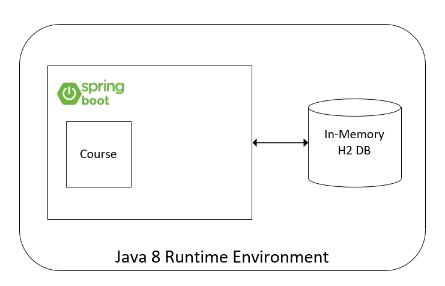

# Accenture Hiring Challenge
***
# Table of Contents
1. [Introduction](#introduction)
2. [Test Gorilla Assessment](#test-gorilla-assessment)
3. [Hands-On Challenge](#hands-on-challenge)
4. [Project Deliverable](#project-deliverable)

***
## Introduction
Welcome to the **Accenture Backend Engineering Hiring Challenge**!, this README file contains all the information you need to know to complete your challenge.
The challenge is divided in two main tasks: 

1. [Test Gorilla Assessment](#test-gorilla-assessment)
2. [Hands-on Java & Spring Challenge](#hands-on-challenge)

## Test Gorilla Assessment

The first challenge you need to complete is an assessment in TestGorilla. This assessment consists of a set of 10 technical questions that you'll need to **answer in English** by recording yourself in video; for each question you'll have 2 minutes to answer.

To take the assessment, please invite yourself using this [link](https://assessment.testgorilla.com/testtaker/publicinvitation/cef12446-4d5e-4322-a3c7-f60c78680ad1).

### Requirements
* Good Internet Connection
* Enable your webcam

## Hands On Challenge

The second challenge you'll need to resolve is a hands-on coding challenge. In order to resolve it you'll need to download this [project]() and import it into your preferred IDE.

### Project Requirements
1. Install Oracle JDK 8.
2. Install and Configure Maven.
3. Install a Java IDE. We suggest to use IntelliJ, but you can use others.
4. Install Postman. This will be used to test your endpoints. 
5. Install Git.
6. A GitHub account.

### Project Details

The project that you will work on is a **Java 8** project that uses **SpringBoot** and an **In-Memory H2 database** initialized at runtime to Create, Read, Update and Delete (CRUD) a `Course`. 

The project itself contains a single entity named `Course` and you can find `listCourse` and `deleteCourse` methods already implemented and test cases using JUnit.

Additionally, the project contains a logic challenge in the `com.mx.accenture.challenge.CodeChallenge` class.

### Hands-On Tasks

Next, you'll find the set of tasks you need to achieve to successfully complete your challenge.

1. This project has been deliberately modified to make it fail, so your first task is to find all errors in it in order to make it compile, build and run; also existing endpoints should work. **Note.** Errors can be found all over the project.  

    Once your project runs you can access the Welcome page using this URL http://localhost:8080. The Welcome page will display instructions on how to test your endpoints.   

2. Implement the `findById`, `addCourse` and `updateCourse` methods to the existing `Course` component.
3. Create an additional `Student` component that contains `id`, `name` and `listOfCourses` attributes; the `listOfCourses` attribute should be a list of `Course` objects.
4. Implement the `listAllStudents`, `findStudentById`, `addStudent`, `updateStudent`, `deleteStudent` and `listStudentCourses` methods. **Note.** Update the existing database if needed.
5. While implementing your methods make sure you use Java 8 features; use at least lambdas and streams.  
6. Implement unit testing of methods required on items #2 and #4. **The most coverage you achieve the higher grade you get.**
7. Test your endpoints using Postman. See instructions on Welcome Page. 
8. Solve the Logic Challenge mentioned on [Project Details](#project-details) section. The project already contains a set of test cases to validate that your solution is correct.

## Project Deliverable

You'll have 6 hours to complete all your tasks, once you finish upload your project to a new public GitHub repository. **Very important:** The repository should have a single commit with all your changes and the hour of the commit should be before the 6 hours deadline.  

In the Hiring Challenge platform you will be required to capture the URL address of your repository before you complete it.
 
## Good luck!

> **First Commit, let start!**
